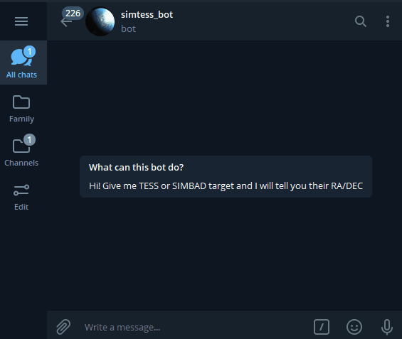

# SimTess-Bot 

A telegram-bot written in python that gives you RA/DEC of given TESS or SIMBAD object.




## Deploying Bot

**Creating a Bot using Bot Father**

<div align="left">
      <a href="https://youtu.be/EE5hTBlRO2M">
         
      </a>
</div>


Remember you `TOKEN`. Define an environment variable `SIMTESS_BOT` with value `<TOKEN>` of you bot.


**Dependencies**

- Python 3
- Python modules
  - use `pip install -r requirements.txt`


```shel
git clone https://github.com/Dishendramishra/simtess-bot
cd simtess-bot
pip install -r requirements.txt
```


**Running Bot**

```shell
python3 main.py &
```


